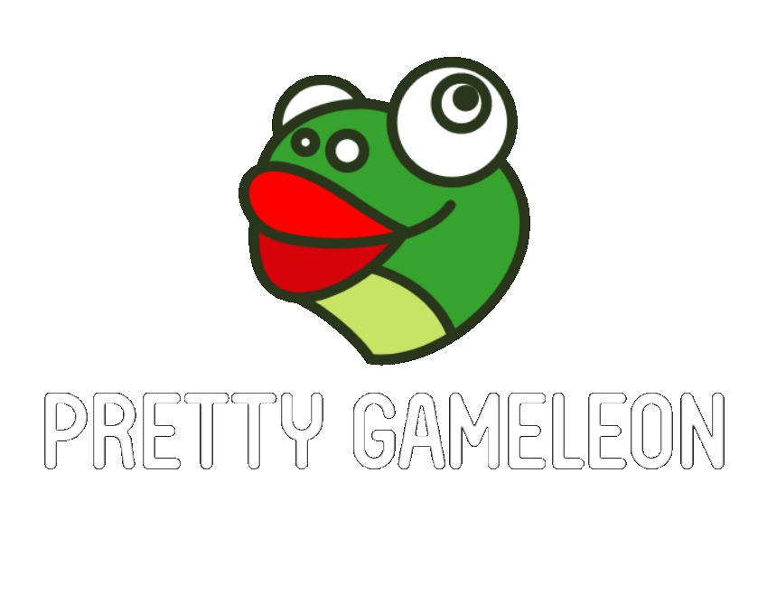

<!-- PROJECT SHIELDS -->
<!--
*** I'm using markdown "reference style" links for readability.
*** Reference links are enclosed in brackets [ ] instead of parentheses ( ).
*** See the bottom of this document for the declaration of the reference variables
*** for contributors-url, forks-url, etc. This is an optional, concise syntax you may use.
*** https://www.markdownguide.org/basic-syntax/#reference-style-links
-->
[![Contributors][contributors-shield]][contributors-url]
[![Forks][forks-shield]][forks-url]
[![Stargazers][stars-shield]][stars-url]
[![Issues][issues-shield]][issues-url]
[![MIT License][license-shield]][license-url]
[![LinkedIn][linkedin-shield]][linkedin-url]


<!-- PROJECT LOGO -->
<br />
<p align="center">
  <a href="https://github.com/sazio/GAMELEON">
    
  </a>

  <h3 align="center">Pretty GAMELEON : Pretty General Agent-based Model (for) Epidemiological (and) Logistical Enquiries On Networks</h3>

  <p align="center">
    Optimizing Urban Mobility Restrictions: a Multi Agent System for SARS-CoV-2 in the City of Toronto
    <br />
    <a href="https://github.com/sazio/GAMELEON"><strong>Explore the docs »</strong></a>
    <br />
    <br />
    <a href="https://github.com/sazio/GAMELEON">View Demo</a>
    ·
    <a href="https://github.com/sazio/GAMELEON/issues">Report Bug</a>
    ·
    <a href="https://github.com/sazio/GAMELEON/issues">Request Feature</a>
  </p>
</p>


<!-- TABLE OF CONTENTS -->
<details open="open">
  <summary>Table of Contents</summary>
  <ol>
    <li>
      <a href="#about-the-project">About The Project</a>
      <ul>
        <li><a href="#built-with">Built With</a></li>
      </ul>
    </li>
    <li>
      <a href="#getting-started">Getting Started</a>
      <ul>
        <li><a href="#prerequisites">Prerequisites</a></li>
        <li><a href="#installation">Installation</a></li>
      </ul>
    </li>
    <li><a href="#usage">Usage</a></li>
    <li><a href="#roadmap">Roadmap</a></li>
    <li><a href="#contributing">Contributing</a></li>
    <li><a href="#license">License</a></li>
    <li><a href="#contact">Contact</a></li>
    <li><a href="#acknowledgements">Acknowledgements</a></li>
  </ol>
</details>


<!-- ABOUT THE PROJECT -->
## About The Project

We developed a Multi-Agent System (MAS) representing the SARS-CoV-2 pandemic, focused on tracing contagion paths and allowing optimization of mobility restrictions. We deployed our model on open data from the metropolitan area of Toronto, embedding rich, spatial demographics, hourly mobility data and daily contagion data in our modeling framework of choice, GAMA. The model's free parameters are designed to be easily derived from literature and/or healthcare data. End-users (ideally policy-makers and researchers) may employ our GAMA-based interface to implement mobility restrictions in urban epidemics, compare their outcomes with past strategies or better plan for future measures.

### Built With

Major Frameworks 

* [GAMA](https://gama-platform.github.io/)


<!-- GETTING STARTED -->
## Getting Started

This is an example of how you may give instructions on setting up your project locally.
To get a local copy up and running follow these simple example steps.

### Prerequisites

This is an example of how to list things you need to use the software and how to install them.
* npm
  ```sh
  npm install npm@latest -g
  ```

### Installation

1. Get a free API Key at [https://example.com](https://example.com)
2. Clone the repo
   ```sh
   git clone https://github.com/your_username_/Project-Name.git
   ```
3. Install NPM packages
   ```sh
   npm install
   ```
4. Enter your API in `config.js`
   ```JS
   const API_KEY = 'ENTER YOUR API';
   ```


<!-- USAGE EXAMPLES -->
## Usage

Use this space to show useful examples of how a project can be used. Additional screenshots, code examples and demos work well in this space. You may also link to more resources.

_For more examples, please refer to the [Documentation](https://example.com)_


<!-- ROADMAP -->
## Roadmap

See the [open issues](https://github.com/othneildrew/Best-README-Template/issues) for a list of proposed features (and known issues).


<!-- CONTRIBUTING -->
## Contributing

Contributions are what make the open source community such an amazing place to be learn, inspire, and create. Any contributions you make are **greatly appreciated**.

1. Fork the Project
2. Create your Feature Branch (`git checkout -b feature/AmazingFeature`)
3. Commit your Changes (`git commit -m 'Add some AmazingFeature'`)
4. Push to the Branch (`git push origin feature/AmazingFeature`)
5. Open a Pull Request


<!-- LICENSE -->
## License

Distributed under the MIT License. See `LICENSE` for more information.


<!-- CONTACT -->
## Contact

Simone Azeglio -  simone.azeglio@edu.unito.it

Matteo Fordiani - matteo.fordiani@edu.unito.it

Project Link: [https://github.com/sazio/GAMELEON](https://github.com/sazio/GAMELEON)


<!-- ACKNOWLEDGEMENTS -->
## Acknowledgements
* [GitHub Emoji Cheat Sheet](https://www.webpagefx.com/tools/emoji-cheat-sheet)
* [Img Shields](https://shields.io)
* [Choose an Open Source License](https://choosealicense.com)
* [GitHub Pages](https://pages.github.com)
* [Animate.css](https://daneden.github.io/animate.css)
* [Loaders.css](https://connoratherton.com/loaders)
* [Slick Carousel](https://kenwheeler.github.io/slick)
* [Smooth Scroll](https://github.com/cferdinandi/smooth-scroll)
* [Sticky Kit](http://leafo.net/sticky-kit)
* [JVectorMap](http://jvectormap.com)
* [Font Awesome](https://fontawesome.com)


<!-- MARKDOWN LINKS & IMAGES -->
<!-- https://www.markdownguide.org/basic-syntax/#reference-style-links -->
[contributors-shield]: https://img.shields.io/github/contributors/sazio/GAMELEON.svg?style=for-the-badge
[contributors-url]: https://github.com/sazio/GAMELEON/graphs/contributors

[forks-shield]: https://img.shields.io/github/forks/sazio/GAMELEON.svg?style=for-the-badge
[forks-url]: https://github.com/sazio/GAMELEON/network/members

[stars-shield]: https://img.shields.io/github/stars/sazio/GAMELEON.svg?style=for-the-badge
[stars-url]: https://github.com/sazio/GAMELEON/stargazers

[issues-shield]: https://img.shields.io/github/issues/sazio/GAMELEON.svg?style=for-the-badge
[issues-url]: https://github.com/sazio/GAMELEON/issues

[license-shield]: https://img.shields.io/github/license/sazio/GAMELEON.svg?style=for-the-badge
[license-url]: https://github.com/sazio/GAMELEON/blob/master/LICENSE

[linkedin-shield]: https://img.shields.io/badge/-LinkedIn-black.svg?style=for-the-badge&logo=linkedin&colorB=555
[linkedin-url]: https://www.linkedin.com/company/machine-learning-journal-club/

[product-screenshot]: images/screenshot.png
